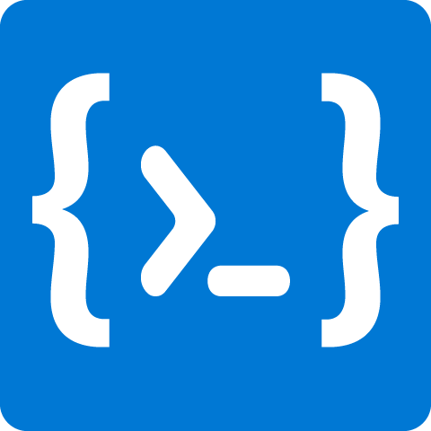
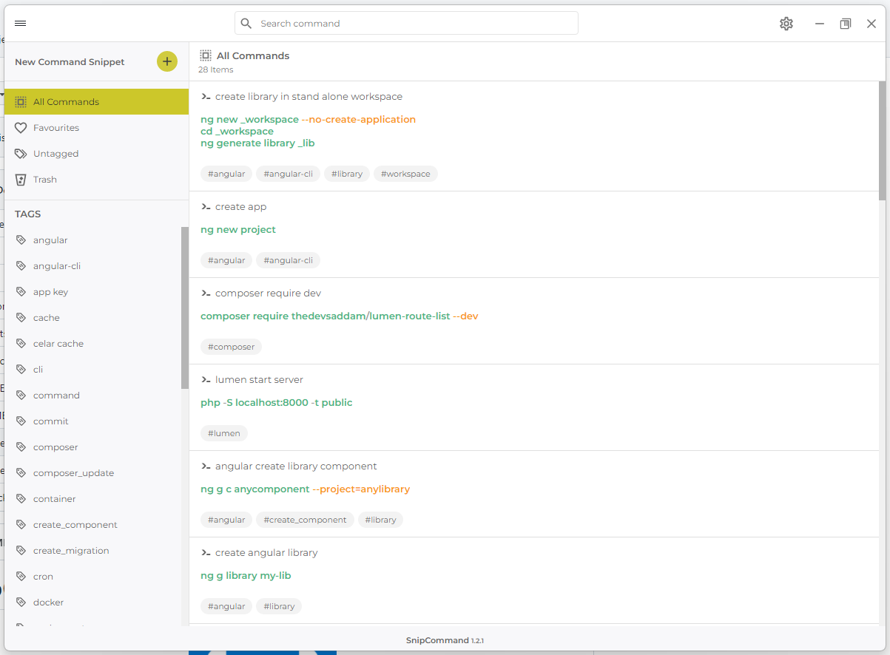

# SnipCommand

<p align="center">
  
</p>

<p align="center">
  
  
  
  
</p>

<p align="center">
  
</p>

## Overview

It helps you create, organize and store your commands (Excel formulas, Sql Queries, Terminal commands, etc.) with dynamic parameters for quick copy to it. Describe your commands with dynamic parameters also support documentation about your snippets. You can select or specify your dynamic values using with selectbox/inputbox for ready to paste the workspace. You can organize with tags.


## 📢 Key Features

- Cross-platform
- Organize all commands with **tags** & **favourites** feature.
- Describe dynamic parameters. Supporting input & selectbox for choosing parameter value.
- Describe documentation text for each commands with Markdown Editor.
- Automatically saves any changes you make during work, so you don't have to worry about losing changes.
- You can use any service that provides cloud synchronization, such as iCloud Drive, Google Drive, Dropbox etc.
- We are using [Lowdb - Powered by Lodash](https://github.com/typicode/lowdb) to store your data. The database files are on your local computer.
- Dark, light and auto theme support.


### Build Setup

```
# install dependencies
npm i

# serve app with electron
npm run electron

# build electron application for production
npm release
```

## Releases

Download latest release builds at [releases](https://github.com/EgoistDeveloper/SnipCommand/releases) page.

## Documentation

Visit the [this link](https://github.com/EgoistDeveloper/SnipCommand/blob/master/documentation/DOCUMENTATION.md)

## About project continuation

[Original Project Owner](https://github.com/gurayyarar/SnipCommand) seems inactive and my PR's waiting for maintainer. So, I decided continue with my way and I am open for new ideas and pull requests.
